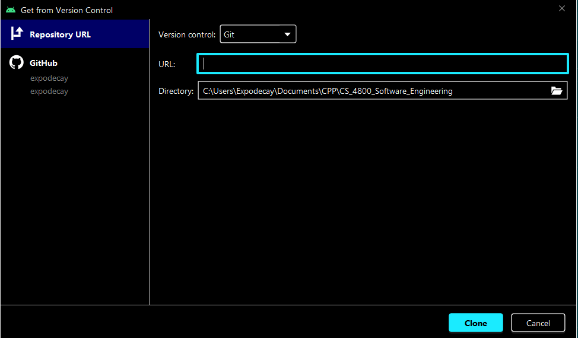
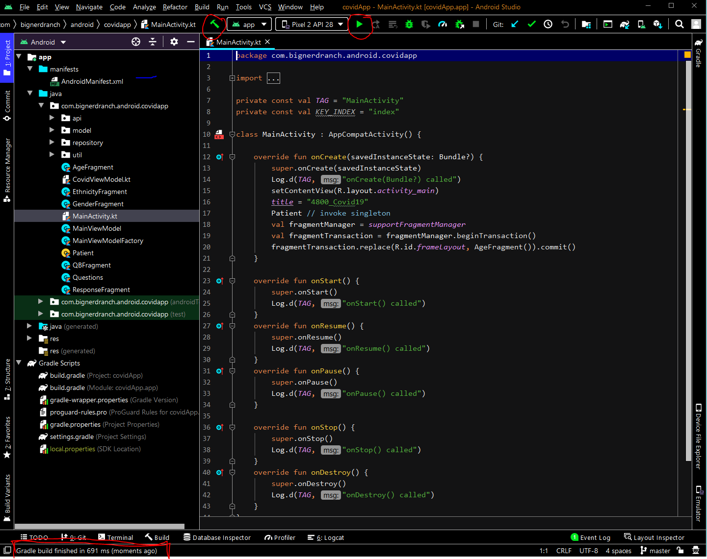
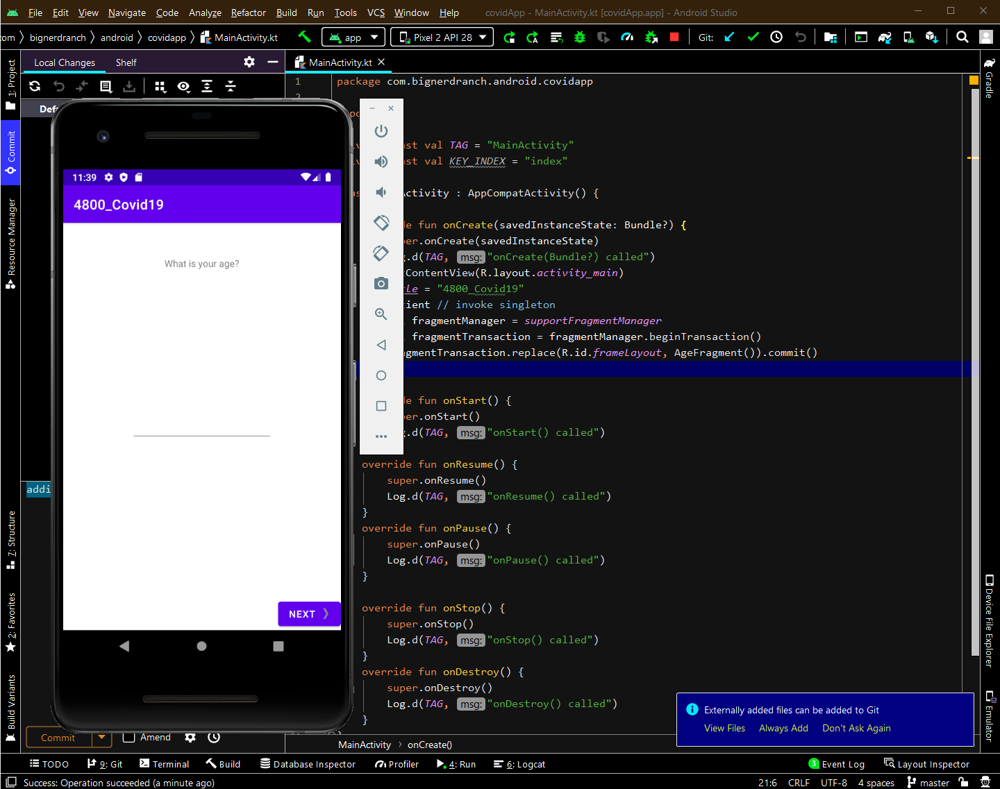

# CS 4800 Covid19 Android Mobile Application
[summary]

# GIT
git clone --recurse-submodules < git ot https url >

## Android Studio Setup
You can download android studio from here https://developer.android.com/studio. 

Once it is installed you can clone the repoitory my siging into github and creating a tokin login

The project should compile and build automatically by selecting either the run or build button and will show completion at the bottom the screen

Once complete, the emulator can be run by selecting the green arrow at which point the application should execute with a "success" at the bottom of the screen

